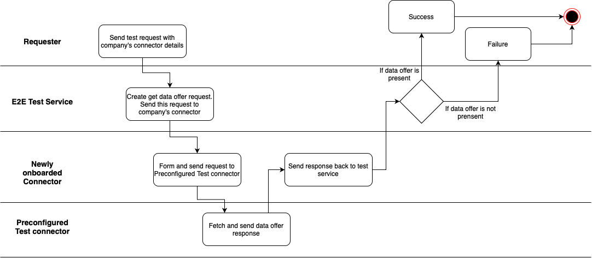
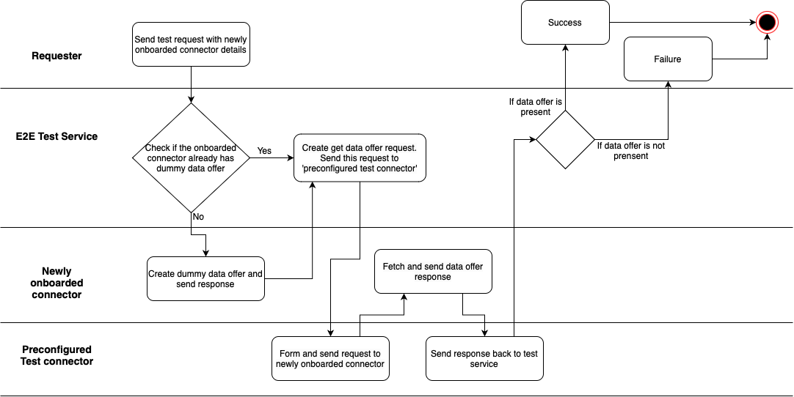

# Arc 42 End to End Data Exchange Test 

## NOTICE

This work is licensed under the [Apache-2.0](https://www.apache.org/licenses/LICENSE-2.0).

- SPDX-License-Identifier: Apache-2.0
- SPDX-FileCopyrightText: 2023 T-Systems International GmbH
- SPDX-FileCopyrightText: 2023 Contributors to the Eclipse Foundation
- Source URL: https://github.com/eclipse-tractusx/data-exchange-test-service

## Introduction and Goals

E2E Data Exchange Test Service(E2E-DETS) is a Catena-X Service, 
which allows testing of connector as Consumer and Provider. 
This Service can be used by Autosetup service or even by end user
(if there is such requirement) to check whether their connector is working correctly

## Requirements Overview 

### High Level Requirements


* E2E-DETS should provide API endpoints which will allow other service to send the connector details for
testing of the connector as a Consumer and Provider.

### Non-functional requirements

*   The E2E-DETS will have to be: accessible, easy to use, secure, efficient etc.
*   The E2E-DETS will only support EDC Version 0.4.1

### Quality Goals

| Priority | Quality-Goal | Scenario                                     |
|----------|--------------|----------------------------------------------|
| 1        | Security     | Open service.                                |
| 1        | Integrity    | Open service.                                |
| 1        | Reliability  | The microservices are available 99.9999%.    |
| 2        | Ease-of-use  | The E2E-DETS will provide ease-of-use API. |

## Architecture Constraints

E2E-DETS can be running  only under the Catena-X domain. While providing connector for
testing to the E2E-DETS, make sure that connector is registered under same DAPS as
preconfigured test connector.

## System Scope and Context

### Business Context
When we onboard any company using our Autosetup service, we do setup connector for the
onboarded company. Before handover all the details to the end user we need to ensure
that our connector setup works correctly. This is where we can take help of the APIs
developed in the 'End to End Data Exchange Test Service' (E2E-DETS). This service should
only require the newly onboarded connector details, and it performs some end-to-end
testing as a consumer and as a provider to give back result of connector testing.

### Technical Context
Information needed for end to end testing of connector:
* URL of the onboarded connector 
* API header of the onboarded connector 
* API key of the the onboarded connector

**Implementation strategy**
Terminologies used in this strategy:

| Connector name               | Purpose                                             |
|------------------------------|-----------------------------------------------------|
| company's connector          | It refers to the connector of the onboarded company |
| Preconfigured test connector | One preconfigured test connector inside E2E-DETS    |

1. Setup one 'preconfigured test connector' (One time setup which will be used for all connector testing)
2. Setup one separate service(E2ETestService), which will have 'preconfigured test connector' details preconfigured. 
   1. Test company's connector as a consumer
      1. This E2ETestService will have one API which will accept company’s connector details like host, apiKey and value. Using those details E2EService will try to access the preconfigured connector's data offer. If we are able to access that data offer then we can conclude that company's connector can work as a consumer.
         
   2. Test company's connector as a provider
      1. E2E test service will create one dummy data offer for company's connector. Then by using 'test connector's details we will try to access that data offer of company's connector. If we can access that data offer then we can conclude that company's connector can act as a provider as well.
         

### REST Interface
There are two APIs we have provided in this service,
1. To test the newly onboarded connector using preconfigured test connector 
POST /connector-test 
```json
{
    "connectorHost": "https://connector-url.com",
    "apiKeyHeader": "X-Api-Key",
    "apiKeyValue": "password"
}
```
2. Test your connector with any other network connector (which you need to provide in the request)
POST /own-connector-test
```json
{
  "firstConnectorHost": "https://first-connector-url.com",
  "firstApiKeyHeader": "first-connector-X-Api-Key",
  "firstApiKeyValue": "first-connector-password",
  "secondConnectorHost": "https://second-connector-url.com",
  "secondApiKeyHeader": "second-connector-X-Api-Key",
  "secondApiKeyValue": "second-connector-password"
}
```
Responses:

| code | description                                     |
|------|-------------------------------------------------|
| 200  | Connector is working as a consumer and provider |
| 500  | Connector is not working properly               |

## **Deployment View**

<br />
For deployment, we are using [ArgoCD](https://argo-cd.readthedocs.io/en/stable/) and Helm. The Helm configuration can be found in folder "charts" in respective repositories.

<br />

## Glossary

| Term                         | description                                                                               |
|------------------------------|-------------------------------------------------------------------------------------------|
| E2E-DETS                     | End to end data exchange test service.                                                    |
| Preconfigured test connector | This will be a preconfigured connector which we will use for testing of other connectors. |
| Company's connector          | It refers to the newly onboarded company's connector.                                     |
